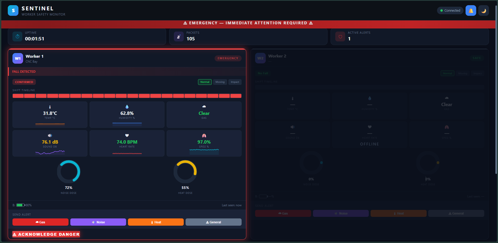

# 🛡️ SENTINEL – Smart Emergency & Health Tracking System

> Real-time wearable IoT safety monitor for industrial workers. Low-cost, offline-ready, and engineered for rapid emergency response using bidirectional ESP-NOW communication.

## 📸 Project Gallery

| Physical Wearable Prototype | Live Dashboard & Analytics | Emergency Alert & Bidirectional Comms |
|:-------------------------:|:--------------------------:|:-----------------------------------:|
|  |  |  |

## ✨ Key Features

- 🆘 **4-Stage Fall Detection:** `Free Fall → Impact → Watching Recovery → Confirmed` (eliminates false positives)
- 🔄 **Full-Duplex ESP-NOW:** Collision-free, dynamic peer registration, <10ms transmission latency
- 🔔 **Persistent "Sticky SOS":** Emergency alerts remain active until manually acknowledged on the dashboard or physically reset by the worker
- 📊 **Live Industrial Dashboard:** Real-time sparklines, circular dose gauges, shift analytics, audio-visual alarms, and event logging
- 🌡️ **Multi-Sensor Monitoring:** Gas (MQ-2), Temperature/Humidity (DHT22), HR/SpO₂ (MAX30102), Acceleration (MPU6050)
- 💡 **Edge Safety Logic:** Status computation runs on-device; alerts trigger instantly even if the link drops

## 🛠️ Technology Stack

| Layer | Technologies |
|:---|:---|
| **Hardware** | ESP32, MPU6050, DHT22, MQ-2, MAX30102, SSD1306 OLED, Buzzer/LEDs |
| **Firmware** | C/C++ (Arduino), ESP-NOW, AsyncWebServer, ArduinoJson, `esp_task_wdt` |
| **Dashboard** | Vanilla JS, WebSockets, SVG Gauges/Sparklines, Web Audio API, CSS3 Animations |
| **Architecture** | Master-Slave IoT, Edge Processing, CSMA/CA + MAC-ACK retransmission |

## 📡 How It Works

1. **Worker Node** continuously samples sensors & computes safety status locally.
2. Telemetry streams to the **Admin Hub** via ESP-NOW (`500ms` in emergency, `2s` normal).
3. Hub aggregates data, manages peer registry, and broadcasts to the web dashboard via **WebSockets**.
4. Admin can trigger inline alerts or acknowledge emergencies; commands route back to the specific worker via ESP-NOW.

## ⚙️ Quick Setup

1. Flash `Admin_v6.ino` to the Hub ESP32 & `Worker_v6.ino` to each worker node.
2. Upload `index.html`, `style.css`, and `app.js` to ESP32 LittleFS.
3. Connect to `SENTINEL-HUB` WiFi, open `http://192.168.4.1` in any browser.
4. Power on workers – they auto-register and begin streaming telemetry.

## 📖 Documentation & References

- 📄 [Project Report & PPT](./docs/final-review-ppt.pdf)
- 🔬 Based on research in wearable IoT safety systems & ESP-NOW field performance analysis
- 📚 Referenced: IEEE Sensors Journal, IndiaSpend Industrial Safety Reports, WONS 2025

## 👥 Team & Credits

Built by **Team Core Dumped**  
🎓 *Asif Ahamed S, Akshaya Kumar P, Sarvesh P*  
Department of Electronics & Communication Engineering, Rajalakshmi Engineering College  
© 2026 SENTINEL v6.0 – Open for academic & SME deployment showcase.# sentinel
